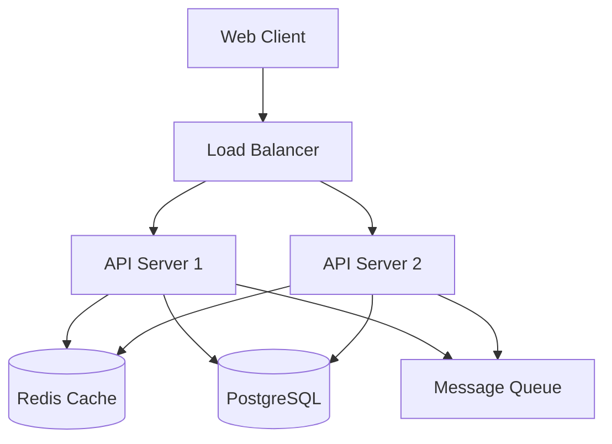
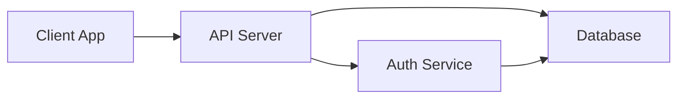
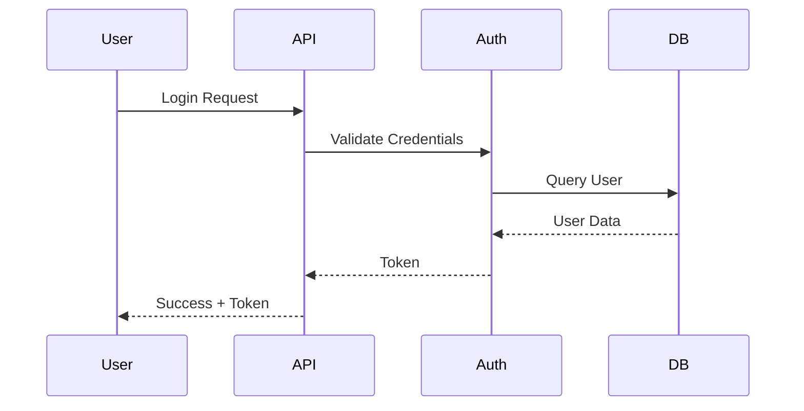
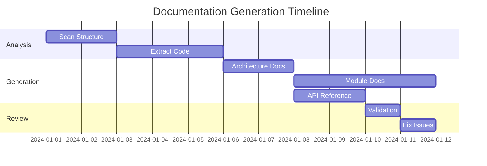
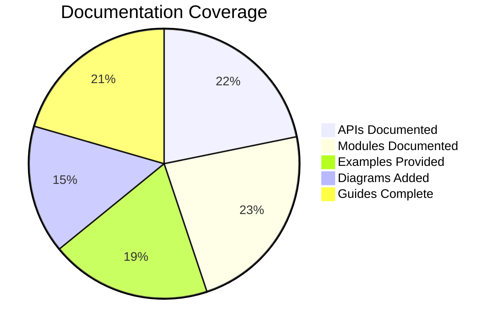
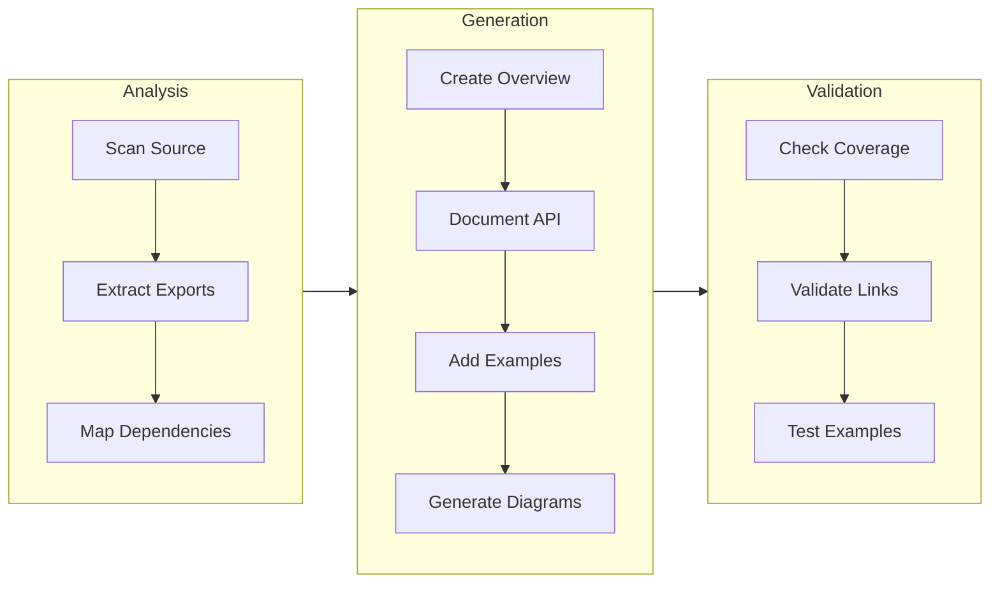
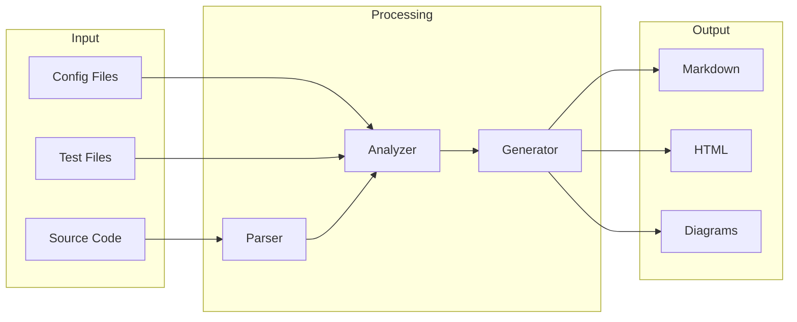

# Deep Wiki - Codebase Documentation Generator

## Overview

This skill guides you in creating comprehensive, navigable documentation for any codebase, similar to what [DeepWiki.com](https://deepwiki.com) provides. The documentation is saved to a `.docs/` directory in HTML or Markdown format, analyzing code structure, extracting relationships, and creating an interactive wiki.

**Note:** This is a methodology skill that guides you through the documentation generation process. It does not provide a command-line tool. Instead, you will analyze the codebase and create documentation manually or with the help of existing documentation tools.

## When to Use

Use this skill when:

- Documenting a new or existing codebase
- Creating architecture documentation
- Generating wiki pages for a project
- The user mentions "deep wiki", "codebase documentation", or "generate docs"
- Onboarding new team members who need codebase understanding
- Preparing project handoff documentation

## Output Structure

```
.docs/
├── index.html (or index.md)
├── architecture/
│   ├── overview.html
│   ├── components.html
│   ├── data-flow.html
│   └── dependencies.html
├── modules/
│   ├── module-name/
│   │   ├── overview.html
│   │   ├── api.html
│   │   └── examples.html
├── api/
│   ├── endpoints.html (for APIs)
│   └── reference.html
├── guides/
│   ├── getting-started.html
│   ├── development.html
│   └── deployment.html
└── assets/
    ├── diagrams/
    └── images/
```

**Important:** Generated documentation should use [Mermaid](https://mermaid.js.org/) diagrams for all visualizations. Mermaid renders flowcharts, sequence diagrams, class diagrams, entity relationship diagrams, Gantt charts, and more directly in Markdown/HTML.

## Documentation Generation Process

### Phase 1: Codebase Analysis

1. **Scan Project Structure**
   - Identify main directories and their purposes
   - Detect project type (library, application, API, etc.)
   - Find configuration files (package.json, requirements.txt, Cargo.toml, etc.)
   - Identify entry points and main modules

2. **Extract Code Structure**
   - Parse source files for classes, functions, modules
   - Extract type definitions and interfaces
   - Identify dependencies between modules
   - Map import/export relationships

3. **Analyze Relationships**
   - Build dependency graph
   - Identify core components vs utilities
   - Detect architectural patterns (MVC, microservices, monorepo, etc.)
   - Find circular dependencies

### Phase 2: Documentation Generation

1. **Architecture Documentation**

   ````markdown
   # Architecture Overview

   ## System Design

   [High-level description of the system]

   ## Components

   - **Component A**: [Description]
   - **Component B**: [Description]

   ## Data Flow

   ```mermaid
   flowchart LR
       Client[Client] --> API[API Server]
       API --> Services[Services]
       Services --> Database[(Database)]
       API --> Cache[(Cache)]
   ```
   ````

   ## Dependencies

   ```mermaid
   graph TD
       A[Main App] --> B[Auth Module]
       A --> C[API Module]
       A --> D[Database Module]
       B --> C
       C --> D
   ```

   ```

   ```

2. **Module Documentation**

   ````markdown
   # Module: [module-name]

   ## Overview

   [What this module does]

   ## Public API

   ### Functions

   - `functionName(param1, param2)`: [Description]

   ### Classes

   - `ClassName`: [Description]

   ## Dependencies

   ```mermaid
   graph LR
       A[[module-name]] --> B[Dependency 1]
       A --> C[Dependency 2]
   ```
   ````

   ## Examples

   [Code examples showing usage]

   ```

   ```

3. **API Documentation** (for APIs)

   ````markdown
   # API Reference

   ## Endpoints

   ### GET /api/users

   **Description**: Retrieve all users
   **Parameters**:

   - `page` (query): Page number (default: 1)
   - `limit` (query): Items per page (default: 20)

   **Response**:
   \`\`\`json
   {
   "users": [...],
   "total": 100,
   "page": 1
   }
   \`\`\`

   ### Request Flow

   ```mermaid
   sequenceDiagram
       participant Client
       participant API
       participant DB

       Client->>API: GET /api/users?page=1
       API->>DB: SELECT users LIMIT 20
       DB-->>API: [user1, user2, ...]
       API-->>Client: {users: [...], total: 100}
   ```
   ````

   ```

   ```

4. **Getting Started Guide**

   ```markdown
   # Getting Started

   ## Prerequisites

   - [List of required tools/versions]

   ## Installation

   \`\`\`bash
   [Installation commands]
   \`\`\`

   ## Quick Start

   \`\`\`bash
   [Basic usage commands]
   \`\`\`
   ```

## Documentation Generation Process

### Step 1: Analyze the Codebase

Before generating documentation, analyze the codebase structure:

1. **Scan Project Structure**
   - Identify main directories and their purposes
   - Detect project type (library, application, API, etc.)
   - Find configuration files (package.json, requirements.txt, Cargo.toml, etc.)
   - Identify entry points and main modules

2. **Extract Code Structure**
   - Parse source files for classes, functions, modules
   - Extract type definitions and interfaces
   - Identify dependencies between modules
   - Map import/export relationships

3. **Analyze Relationships**
   - Build dependency graph
   - Identify core components vs utilities
   - Detect architectural patterns (MVC, microservices, monorepo, etc.)
   - Find circular dependencies

### Step 2: Create Documentation Structure

Create the following directory structure:

```bash
mkdir -p .docs/{architecture,modules,api,guides,assets/{diagrams,images}}
```

### Step 3: Generate Documentation Files

Use existing documentation tools appropriate for your language:

**JavaScript/TypeScript:**

- TypeDoc, JSDoc, TSDoc
- Storybook for UI components
- Compodoc for Angular

**Python:**

- Sphinx, pdoc, MkDocs
- Pydoc

**Go:**

- godoc, pkgsite

**Rust:**

- rustdoc

**General:**

- Markdown files for architecture and guides
- Mermaid diagrams for visualizations

## Documentation Templates

### Architecture Overview Template

```html
<!DOCTYPE html>
<html>
  <head>
    <title>{project-name} - Architecture</title>
    <link rel="stylesheet" href="../assets/styles.css" />
    <script src="https://cdn.jsdelivr.net/npm/mermaid/dist/mermaid.min.js"></script>
    <script>
      mermaid.initialize({ startOnLoad: true });
    </script>
  </head>
  <body>
    <nav><!-- Navigation --></nav>
    <main>
      <h1>Architecture Overview</h1>
      <section id="system-design">
        <h2>System Design</h2>
        {system-description}
      </section>
      <section id="components">
        <h2>Components</h2>
        {component-list}
      </section>
      <section id="diagrams">
        <h2>Architecture Diagrams</h2>
        {mermaid-diagrams}
      </section>
    </main>
  </body>
</html>
```

### Module Template

```html
<!DOCTYPE html>
<html>
  <head>
    <title>{module-name} - {project-name}</title>
    <link rel="stylesheet" href="../../assets/styles.css" />
    <script src="https://cdn.jsdelivr.net/npm/mermaid/dist/mermaid.min.js"></script>
    <script>
      mermaid.initialize({ startOnLoad: true });
    </script>
  </head>
  <body>
    <nav><!-- Breadcrumb navigation --></nav>
    <main>
      <h1>{module-name}</h1>
      <section id="overview">
        <h2>Overview</h2>
        {module-description}
      </section>
      <section id="dependencies">
        <h2>Dependencies</h2>
        {dependency-diagram}
      </section>
      <section id="api">
        <h2>Public API</h2>
        {api-documentation}
      </section>
      <section id="examples">
        <h2>Examples</h2>
        {code-examples}
      </section>
    </main>
  </body>
</html>
```

## Generated Documentation Requirements

**All generated documentation MUST include Mermaid diagrams for visualizations.**

### Required Mermaid Diagrams in Output

1. **Architecture Overview Page**
   - Component diagram showing system architecture
   - Data flow diagram showing how data moves through the system
   - Dependency graph showing module relationships

2. **Module Pages**
   - Dependency diagram showing module dependencies
   - Public API flowchart (if applicable)

3. **API Reference Page**
   - Request/response flow sequence diagrams
   - Endpoint relationship diagrams

4. **Dashboard Pages** (optional)
   - Gantt chart for project timelines
   - Pie charts for coverage metrics

### Mermaid Diagram Types to Include

```mermaid
graph TD        %% Dependency graphs
graph LR        %% Component diagrams
flowchart TD    %% Workflows
sequenceDiagram %% Request flows
classDiagram    %% Class relationships
erDiagram      %% Entity relationships
gantt          %% Project timelines
pie            %% Coverage metrics
```

### Example: Architecture Diagram in Generated Docs

````markdown
## Architecture


````

````

### Example: Module Dependency in Generated Docs

```markdown
## Dependencies

```mermaid
graph LR
    UserModule[[User Module]] --> AuthModule[[Auth Module]]
    UserModule --> DatabaseModule[[Database Module]]
    AuthModule --> DatabaseModule
    AuthModule --> CacheModule[[Cache Module]]
````

````

### Example: API Flow in Generated Docs

```markdown
## User Authentication Flow

```mermaid
sequenceDiagram
    participant Client
    participant API
    participant Auth
    participant DB

    Client->>API: POST /login {email, password}
    API->>Auth: Validate credentials
    Auth->>DB: Query user
    DB-->>Auth: User data + hash
    Auth-->>API: Token
    API-->>Client: {token, user}
````

````

### Documentation Workflow

```mermaid
flowchart TD
    A[Analyze Codebase] --> B[Identify Modules]
    B --> C[Extract Structure]
    C --> D[Build Relationships]
    D --> E[Create Doc Structure]
    E --> F[Generate Architecture Docs]
    E --> G[Generate Module Docs]
    E --> H[Generate API Docs]
    F --> I[Add Diagrams]
    G --> I
    H --> I
    I --> J[Validate & Review]
    J --> K{All Checks Pass?}
    K -->|No| L[Fix Issues]
    L --> J
    K -->|Yes| M[Deploy Documentation]
````

### Dependency Graph

```mermaid
graph TD
    A[Main Module] --> B[Auth Module]
    A --> C[Database Module]
    B --> D[User Model]
    C --> D
    D --> E[Utils]
```

### Component Diagram



### Sequence Diagram



### Documentation Dashboard



### Quality Metrics Dashboard



### Module Documentation Flow



### Documentation Structure Overview

```mermaid
block-beta
    columns 1

    block:docs:3
        columns 3
        arch[Architecture<br/>Overview] comp[Components<br/>Diagram] dep[Dependencies<br/>Graph]
    end

    block:modules:3
        columns 3
        mod1[Module 1<br/>Overview] mod2[Module 2<br/>Overview] mod3[Module N<br/>Overview]
    end

    block:api:3
        columns 3
        endpoints[Endpoints<br/>List] ref[API<br/>Reference] schemas[Data<br/>Schemas]
    end

    block:guides:3
        columns 3
        start[Getting<br/>Started] dev[Development<br/>Guide] deploy[Deployment<br/>Guide]
    end

    docs --> modules
    modules --> api
    api --> guides
```

### Data Flow Diagram



## Code Analysis Patterns

### Language-Specific Parsers

**JavaScript/TypeScript:**

- Parse JSDoc/TSDoc comments
- Extract interfaces and types
- Map ES6 modules
- Identify React components

**Python:**

- Parse docstrings (Google, NumPy, Sphinx styles)
- Extract type hints
- Map imports and modules
- Identify classes and functions

**Go:**

- Parse Go doc comments
- Extract package documentation
- Map imports
- Identify exported functions and types

**Rust:**

- Parse rustdoc comments
- Extract traits and structs
- Map module hierarchy
- Identify public APIs

### Architecture Pattern Detection

1. **Monorepo Detection**
   - Multiple package.json/Cargo.toml in subdirectories
   - Workspace configuration files
   - Shared dependencies

2. **Microservices Detection**
   - Multiple services in separate directories
   - Docker compose files
   - API gateway configuration

3. **Library Detection**
   - Export statements in index files
   - Package.json with "main" or "module" field
   - README with installation instructions

4. **MVC/MVVM Detection**
   - Separate directories for models, views, controllers
   - Framework-specific patterns (React, Angular, Django, etc.)

## Best Practices

### 1. Keep Documentation Close to Code

```javascript
/**
 * Authenticates a user with credentials
 * @param {string} username - The user's username
 * @param {string} password - The user's password
 * @returns {Promise<AuthToken>} Authentication token
 * @throws {AuthenticationError} If credentials are invalid
 * @example
 * const token = await authenticate('user', 'pass');
 */
async function authenticate(username, password) {
  // Implementation
}
```

### 2. Use Consistent Naming

- Module names match directory names
- Function names are verb phrases
- Class names are noun phrases
- Constants are UPPER_SNAKE_CASE

### 3. Include Examples

```markdown
## Examples

### Basic Usage

\`\`\`javascript
import { authenticate } from 'auth-module';

const token = await authenticate('user', 'password');
console.log(token.value);
\`\`\`

### With Error Handling

\`\`\`javascript
try {
const token = await authenticate('user', 'password');
} catch (error) {
if (error instanceof AuthenticationError) {
console.error('Invalid credentials');
}
}
\`\`\`
```

### 4. Document Architecture Decisions

```markdown
## Architecture Decision Records

### ADR-001: Use PostgreSQL for Primary Database

**Status**: Accepted

**Context**: Need a reliable, ACID-compliant database for user data.

**Decision**: Use PostgreSQL as the primary database.

**Consequences**:

- Strong data consistency guarantees
- Rich query capabilities
- Requires operational expertise
```

### 5. Keep Diagrams Updated

- Regenerate diagrams when code changes
- Use automated tools for dependency graphs
- Include both high-level and detailed views
- Add descriptions for accessibility

## Output Formats

### HTML Output

- Interactive navigation
- Search functionality
- Syntax highlighting
- Responsive design
- Dark mode support

### Markdown Output

- GitHub-flavored markdown
- Compatible with static site generators
- Easy to edit manually
- Version control friendly

## Integration with CI/CD

```yaml
# GitHub Actions example
name: Generate Documentation

on:
  push:
    branches: [main]
  pull_request:
    branches: [main]

jobs:
  docs:
    runs-on: ubuntu-latest
    steps:
      - uses: actions/checkout@v3

      - name: Generate Documentation
        run: deep-wiki generate --format markdown

      - name: Deploy to GitHub Pages
        uses: peaceiris/actions-gh-pages@v3
        with:
          github_token: ${{ secrets.GITHUB_TOKEN }}
          publish_dir: ./.docs
```

## Common Issues and Solutions

### Issue: Circular Dependencies Detected

**Solution**: Document the circular dependency and recommend refactoring:

```markdown
## Known Issues

### Circular Dependency

The `auth` module imports `user` module, which imports `auth` module.

**Recommendation**: Extract shared types to a separate `types` module.
```

### Issue: Missing Documentation

**Solution**: Generate placeholder documentation with TODOs:

```markdown
## Module: auth

**TODO**: Add module description

### Function: login

**TODO**: Document parameters and return type
```

### Issue: Large Codebase

**Solution**: Generate documentation incrementally:

```bash
# Generate core modules first
deep-wiki generate --modules core,utils

# Then generate feature modules
deep-wiki generate --modules features/*

# Finally, generate full documentation
deep-wiki generate
```

## Quality Checklist

- [ ] All public APIs documented
- [ ] Architecture overview included
- [ ] Dependency graph generated
- [ ] Getting started guide complete
- [ ] Code examples provided
- [ ] Diagrams rendered correctly
- [ ] Navigation works properly
- [ ] Search functionality works
- [ ] Mobile responsive
- [ ] Links are not broken

## Maintenance

### Update Documentation

When code changes, update documentation:

1. **Identify Changed Files**
   - Use git diff to find modified files
   - Identify which modules/components are affected

2. **Update Affected Documentation**
   - Update API documentation for changed functions
   - Update architecture diagrams if dependencies changed
   - Update examples if usage changed

3. **Validate Documentation**
   - Check for broken links
   - Verify code examples still work
   - Ensure diagrams are accurate

### Documentation Validation Checklist

- [ ] All public APIs documented
- [ ] Architecture overview included
- [ ] Dependency graph generated
- [ ] Getting started guide complete
- [ ] Code examples provided
- [ ] Diagrams rendered correctly
- [ ] Navigation works properly
- [ ] Links are not broken

## Quick Reference

### Documentation Generation Steps

1. **Analyze codebase structure** - Identify modules, dependencies, architecture
2. **Create documentation structure** - Set up `.docs/` directory
3. **Generate API documentation** - Use language-specific tools (TypeDoc, Sphinx, etc.)
4. **Write architecture docs** - Create overview, component diagrams, dependency graphs
5. **Create guides** - Getting started, development, deployment
6. **Add examples** - Code examples for common use cases
7. **Validate** - Check links, examples, and accuracy

### Common Documentation Tools

| Language              | Tools                            |
| --------------------- | -------------------------------- |
| JavaScript/TypeScript | TypeDoc, JSDoc, TSDoc, Storybook |
| Python                | Sphinx, pdoc, MkDocs             |
| Go                    | godoc, pkgsite                   |
| Rust                  | rustdoc                          |
| Java                  | Javadoc                          |
| C#                    | DocFX, Sandcastle                |
| General               | Markdown, Mermaid diagrams       |

## Output Example

### Generated Structure

```
.docs/
├── index.html                    # Home page
├── architecture/
│   ├── overview.html            # System architecture
│   ├── components.html          # Component breakdown
│   └── dependencies.html        # Dependency graph
├── modules/
│   ├── auth/
│   │   ├── overview.html        # Auth module overview
│   │   ├── api.html             # Auth API reference
│   │   └── examples.html        # Usage examples
│   └── user/
│       ├── overview.html
│       ├── api.html
│       └── examples.html
├── api/
│   └── reference.html           # API endpoint reference
├── guides/
│   ├── getting-started.html     # Quick start guide
│   ├── development.html         # Development guide
│   └── deployment.html          # Deployment guide
└── assets/
    ├── styles.css              # Documentation styles
    ├── diagrams/               # Generated diagrams
    └── images/                 # Screenshots, diagrams
```

## The Bottom Line

This skill guides you through creating comprehensive, navigable documentation for codebases, similar to what [DeepWiki.com](https://deepwiki.com) provides. By analyzing code structure, extracting relationships, and creating organized documentation, you help developers understand and navigate complex projects efficiently.

**Key Points:**

- This is a methodology, not a command-line tool
- Use existing documentation tools appropriate for your language
- Focus on structure, clarity, and completeness
- Keep documentation close to code and update it regularly
- Validate documentation accuracy and completeness
